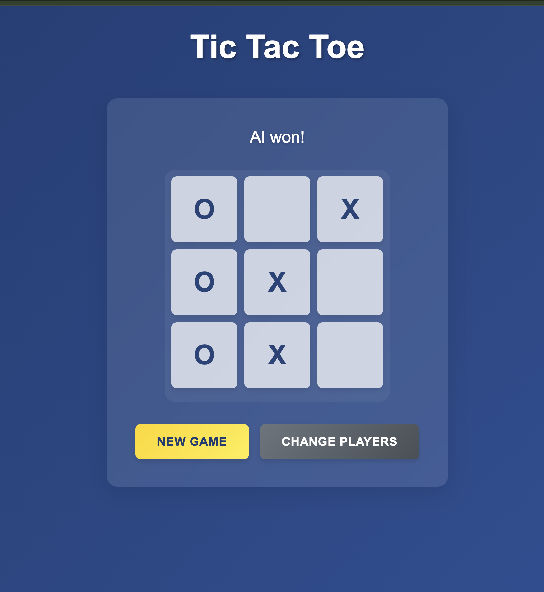

# React Tic Tac Toe with AI

A modern implementation of the classic Tic Tac Toe game built with React, featuring a dynamic board size and an AI opponent.



## Features

- 🎮 Play against AI opponent
- 🎯 Dynamic board sizes (3x3, 4x4, 5x5)
- 🎨 Modern UI with glassmorphism design
- 📱 Fully responsive design
- ⚡ Real-time game state management
- 🤖 Smart AI moves using minimax algorithm
- 🎉 Win detection and game state handling

## Prerequisites

Before running this project, make sure you have:
- Node.js (v14 or higher)
- npm (v6 or higher)
- Backend server running on port 9000

## Installation

1. Clone the repository:
```bash
git clone git@github.com:ishworii/Tic-Tac-Toe-ReactJS-Frontend.git
cd Tic-Tac-Toe-ReactJS-Frontend
```

2. Install dependencies:
```bash
npm install
```

3. Start the development server:
```bash
npm run dev
```

4. Open [http://localhost:5173](http://localhost:5173) in your browser.

## Game Rules

- Players take turns placing their marks (X or O) on the board
- First player to get their marks in a row (horizontally, vertically, or diagonally) wins
- If all cells are filled and no player has won, the game is a draw

## API Integration

The game requires a backend server running on port 9000. The API endpoint expects:

```javascript
// POST /findBestMove
{
  "cellSize": number,    // Board size (3, 4, or 5)
  "board": string[]     // Current board state with null for empty cells
}
```

Response format:
```javascript
{
  "bestMove": number    // Index of AI's chosen move
}
```

## Project Structure

```
src/
├── components/
│   ├── Cell.jsx
│   ├── GameBoard.jsx
│   └── PlayerSelection.jsx
├── styles/
│   └── App.css
├── constants/
│   └── gameConstants.js
├── App.jsx
└── main.jsx
```

## Technology Stack

- React 18
- Vite
- CSS3 with modern features
- RESTful API integration

## Contributing

1. Fork the repository
2. Create your feature branch (`git checkout -b feature/AmazingFeature`)
3. Commit your changes (`git commit -m 'Add some AmazingFeature'`)
4. Push to the branch (`git push origin feature/AmazingFeature`)
5. Open a Pull Request


